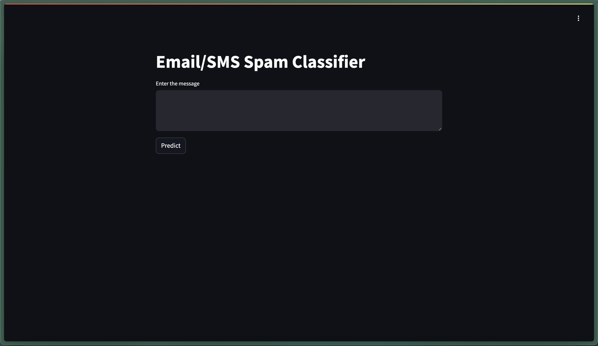

# Email Spam Classifier

This project is an email spam classifier built using Python. It leverages machine learning techniques to classify emails as spam or not spam. The project includes a Streamlit web application for users to interact with the classifier.

## Table of Contents

- [Overview](#overview)
- [Features](#features)
- [Installation](#installation)
- [Usage](#usage)
- [Deployment](#deployment)
- [Contributing](#contributing)
- [License](#license)

## Overview

The Email Spam Classifier uses Natural Language Processing (NLP) techniques to analyze email content and classify it as spam or not spam. The classifier is trained using a dataset of labeled emails and utilizes various Python libraries such as NLTK, Scikit-learn, NumPy, and Pandas.

## Features

- Email classification as spam or not spam
- Interactive web interface using Streamlit
- Model training and evaluation
- Real-time prediction

## Installation

Follow these steps to set up the project locally:

1. Clone the repository:

    ```bash
    git clone https://github.com/akshayyy22/email-spam-classifier.git
    cd email-spam-classifier/pythonProject
    ```

2. Create a virtual environment:

    ```bash
    python -m venv venv
    source venv/bin/activate  # On Windows use `venv\Scripts\activate`
    ```

3. Install the required packages:

    ```bash
    pip install -r requirements.txt
    ```

4. Make the setup script executable:

    ```bash
    chmod +x setup.sh
    ```

## Usage

To run the Streamlit app locally:

1. Ensure the virtual environment is activated:

    ```bash
    source venv/bin/activate  # On Windows use `venv\Scripts\activate`
    ```

2. Run the setup script:

    ```bash
    sh setup.sh
    ```

3. Start the Streamlit application:

    ```bash
    streamlit run app.py
    ```

4. Open your web browser and go to `http://localhost:8501` to interact with the app.

## Deployment

To deploy this application on Render:

1. Push your code to a repository on GitHub, GitLab, or Bitbucket.

2. Sign up on [Render](https://render.com/) and connect your repository.

3. Configure the Render service with the following settings:
    - **Root Directory**: `./pythonProject`
    - **Build Command**: `pip install -r requirements.txt`
    - **Start Command**: `sh setup.sh && streamlit run app.py`

4. Add any necessary environment variables in the Render dashboard under the "Environment" tab.

5. Deploy the service and Render will handle the build and start process.

## ScreenShots



